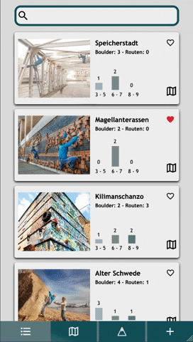

Urbanclimbing is an interactive guide to your favorite climbing-spots.
Keep track of your climbed routes, orientate yourself on the map and
create new climbing adventures for the community.

Urbanclimbing was build as a capstoneproject, using React Js, Node Js,
Mongo DB, Mongoose, CSS, Styled Components, Storybook, Proptypes and many more!
